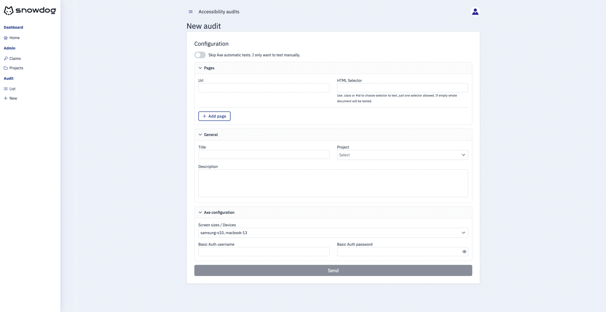

# A11y Audit Tool

**A11y Audit Tool** is your comprehensive solution for web accessibility testing and report generation. With both automated and manual testing capabilities, this tool ensures your website's compliance with WCAG (Web Content Accessibility Guidelines) and helps you identify and address accessibility issues effectively.



## Key Features

* **Automated Tests**: Run automatic tests on any website across many pages and various screen sizes.
* **Manual Tests**: Conduct manual tests using our template based on the Trusted Tester Conformance Process.
* **Combined Testing Approach**: Seamlessly integrate automatic tests with manual tests for comprehensive auditing.
* **Downloadable Reports**: Generate reports for easy reference and collaboration, facilitating improvement efforts.
* **Project Organization**: Group audits into projects for better organization and management of accessibility testing efforts.

## Why Choose A11y Audit Tool?
* **Comprehensive Testing**: Unlike most tools that focus solely on automatic or manual tests, our tool offers both, ensuring comprehensive results. During manual tests, you can review and comment on automatic test results.
* **Guided Testing**: Our audit template guides you through accessibility features. It provides test conditions and techniques to solve issues. A tester doesn't need to be an expert in the accessibility field to perform an audit using our tool.
* **Multi-page and Multi-screen Testing**: Test multiple pages (URLs) and screen sizes in a single audit, enhancing efficiency.
* **Clear Reports**: Generated reports are clear and understandable, facilitating discussions with clients and roadmap planning for improvement efforts.
* **Extensibility**: Extend the tool's capabilities by adding custom test cases using Playwright, reducing manual work and enhancing efficiency.

## Application setup

Make sure to install the dependencies:

```bash
# pnpm
pnpm install
```

### Development Server

#### Supabase instance

Steps to run project locally:

1. Run `npx supabase login` and pass generated access token
2. Run `npx supabase start`
3. Pass envs from supabase started setup to `.env` file:
  * `API URL` 👉 `SUPABASE_URL`
  * `anon key` 👉 `SUPABASE_KEY`
  * `service_role key` 👉 `SUPABASE_SERVICE_KEY`

Docs references: https://supabase.com/docs/guides/getting-started/local-development

#### Nuxt application

Start the development server on `http://localhost:3000`

```bash
pnpm dev
```

### Https configuration

**Install `mkcert` on your system**. The installation instructions for macOS, Windows and Linux can be found in the mkcert [Github repository](https://github.com/FiloSottile/mkcert).

**Create a valid certificate by running the following command in your project folder:**
<pre>
mkcert [-install] localhost
</pre>

**Run your project using**
<pre>
npm run dev-secure
</pre>

Your project will now be served on https://localhost:3000.

## Production

Build the application for production:

```bash
pnpm build
```

Locally preview production build:

```bash
pnpm preview
```

## Application Supabase setup steps

1. Create [supabase](https://supabase.com/) (DB schema installation process described below) project or use existing one
2. Create `.env` file within exposed in `.env.example` variables, fill then with appropriate values before build/development run
3. Create user(s) in DB - auth service. Manage admin/user roles as described below

## Application DB setup

[Supabase](https://supabase.com/dashboard/projects) projects rely on the [postgresql](https://www.postgresql.org/) database engine. In the `./sql/` directory you will find all the sql installation files needed to make the whole application useful.

### Schema setup

To install the necessary schema, please go to the [SQL Editor](https://supabase.com/docs/guides/database/overview#the-sql-editor) tab of your project and `RUN` all sql lines in the order presented on directory and inner file level.

### Project public tables overview

#### Structure

1. `audits` table columns:

- `id`
- `created_at` (timestamp)
- `updated_at` (optional, timestamp)
- `profile_id` (references public.profiles)
- `project_id` (references public.projects)
- `status` (`draft` or `completed`)
- `report_type` (`review`, `functional` or `wcag`)
- `config` (optional, JSON data)
- `issues` (optional, JSON data)

2. `profiles` table columns:

- `id` (references auth.users)
- `updated_at` (optional, timestamp)
- `username` (optional, unique)
- `full_name` (optional)
- `avatar_url` (optional, feature not implemented)
- `user_type` (optional, `viewer` or `auditor`)

3. `projects` table columns:

- `id`
- `name` (text)
- `description` (optional)

4. `profile_project` table columns:

- `profile_id` (references public.profiles)
- `project_id` (references public.projects)

Primary key is on both columns `profile_id` and `project_id`

5. `axe` table columns:

- `id`
- `created_at` (timestamp)
- `audit_id` (references public.audits),
- `selector` (text)
- `size` (text)
- `results` (JSON data)

#### Policy rules (RLS) per table

1. `audits` - viewable for both `admin` and granted (added to `profile_project` table) users, **only** `user` with `auditor` role can insert audits and edit them while status is set to `draft`, only `admin` user can delete and update audits anytime
2. `profiles` - can be created and updated by both `user` and `admin`
3. `projects` - viewable for both `admin` and granted (added to `profile_project` table) users, only `admin` can insert/update projects
4. `profile_project` - viewable for anyone, only `admin` can insert/delete permissions
5. `axe` - viewable for anyone, only `admin` can delete results

### TypeScript db data types support

Generated types are stored in `types/supabase.ts` file. After any change in tables/columns structure please regenerate this file.

To regenerate types you need to:

- Install `npx supabase` package
- Run `npx supabase login` and authenticate yourself within [token](https://app.supabase.com/account/tokens)
- Run `npx supabase gen types typescript --project-id "PROJECT_REF_NAME_GOES_HERE" --schema public > types/supabase.ts`

To use then in app simply pass `Database` interface as expected generic type for client connections. Example:

```JavaScript
const supabaseClient = useSupabaseClient<Database>()
```

### Admin role

Role information is stored on the user custom claim level and can be found in `claims_admin` auth user's property.

Usage example with `supabase` client module:

1. Get information if user is `admin`:

- via supabase client sdk:

  ```JavaScript
  const { data: isAdmin } = await useSupabaseClient().rpc('is_claims_admin')
  ```

- via sql editor:
  ```sql
  select get_claims('PASS-HERE-SPECIFIC-USER-UUID-FROM-AUTH-TABLE');
  ```

2. Add `admin` role for specific user via sql editor:

```sql
select set_claim('PASS-HERE-SPECIFIC-USER-UUID-FROM-AUTH-TABLE', 'claims_admin', 'true');
```

:warning: You will need to log in again to see the changes.

### User role

:warning: Not specified by default. After change, you will need to log in again to see the changes.

Only the Admin can grant users with `user_role`.

When custom claim `user_role` is set/updated, the corresponding information in the `profiles` table (`user_type` column) is also updated.

#### User role setup

In app we recognize both `auditor` and `viewer` role. To setup then you need to update user's context. You can do it:

- via supabase client sdk:

  ```JavaScript
  const userRole = 'auditor' // or 'viewer'
  const { error } = await setClaim(id, 'user_role', userRole)
  ```

- via sql editor:
  ```sql
  select set_claim('PASS-HERE-SPECIFIC-USER-UUID-FROM-AUTH-TABLE', 'user_role', '"auditor"');
  ```

### Custom claims

Custom Claims are special attributes attached to a user that you can use to control access to portions of your application. You can find more information here: https://github.com/supabase-community/supabase-custom-claims#faq

More usage examples: https://github.com/supabase-community/supabase-custom-claims#usage

## Contributing
Contributions are welcome! If you find a bug or have a feature request, feel free to open an issue or submit a pull request.

## Like this project?
We'd appreciate it if you leave a ⭐ or share it with the world ✨.
